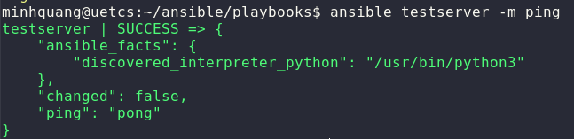
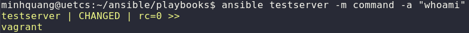
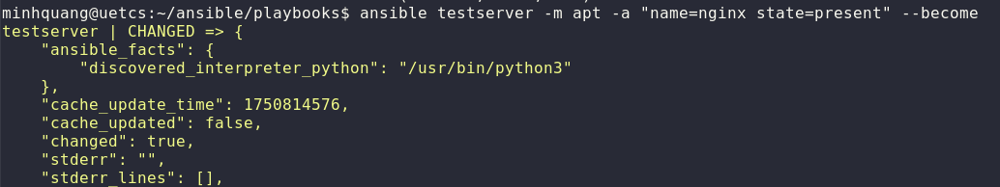

# Ansible Ad-Hoc
## 1. Định nghĩa
> **Ansible Ad-Hoc** là cách chạy lệnh 1 lần trực tiếp từ CLI để thực thi một module trên tất cả các host, không cần viết playbook. Dùng khi cần kiểm tra nhanh hệ thống, chạy lệnh đơn giản, debug.
```bash
ansible <group> -i <inventory> -m <module> -a "<arguments>"
```
- `group`: tên group
- `-i <inventory>`: Chỉ định đường dẫn của inventory
- `-m <module>`: Chỉ định module
- `-a "<arguments>"`: Tham số của module
- Để sử dụng quyền `sudo` thêm `--become` hoặc `-b`
# 2. Một số Module
- `ping`: test


- `command`: Chạy lệnh


- `copy`: Copy file
```bash
ansible webservers -m copy -a "src=a.txt dest=/tmp/a.txt"
```
- `apt`: Cài package


