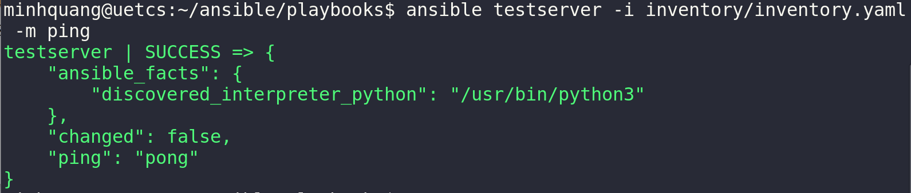
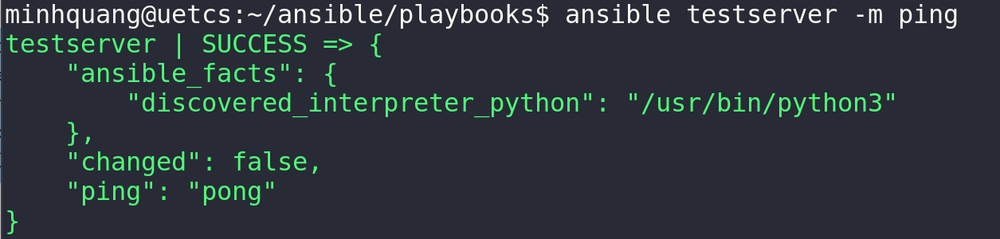

# Building an Inventory
## 1. Ansible Inventory
> **Ansible Inventory** là file liệt kê tất cả các server mà Ansible sẽ quản lý. Mỗi server sẽ chứa các thông tin *name, ip và thông tin chi tiết*. **Ansible Inventory file** có thể được viết bằng định dạng `INI` hoặc `yaml`.

```yaml
all:
  children:
    webservers:
      hosts:
        web1:
          ansible_host: 192.168.1.10
          ansible_user: ubuntu
          ansible_port: 22
          ansible_ssh_private_key_file: ~/.ssh/id_rsa
        web2:
          ansible_host: 192.168.1.11
          ansible_user: ubuntu
          ansible_port: 22
          ansible_ssh_private_key_file: ~/.ssh/id_rsa
    dbservers:
      hosts:
        db1:
          ansible_host: 192.168.1.12
          ansible_user: ubuntu
```
- `webservers` và `dbservers` là các group.
- `ansible_host`: IP của server.
- `ansible_user`: User SSH vào server.
## 2. Create Variables
`vars` là các biến áp dụng cho toàn bộ server trong group mà không cần hardcode. Giúp tránh lặp lại cấu hình, quản lý tập trung. Thay vì định nghĩa inventory như phía trên, sẽ định nghĩa các `vars` như sau:
```yaml
all:
  children:
    webservers:
      hosts:
        web1:
          ansible_host: 192.168.1.10
        web2:
          ansible_host: 192.168.1.11
      vars:
        ansible_user: ubuntu
        ansible_port: 22
        ansible_ssh_private_key_file: ~/.ssh/id_rsa
    dbservers:
      hosts:
        db1:
          ansible_host: 192.168.1.12
          ansible_user: ubuntu
```
## 3. ansible.cfg

Để ping đến các server, sử dụng ad hoc:
```bash
ansible <group/server> -i <inventory_src> -m ping
```
Để không phải gõ lại `inventory_src` mỗi lần gõ ad hoc, có thể thêm default vào `ansible.cfg`.
```cfg
[defaults]
inventory = <inventory_src>
host_key_checking = False
stdout_callback = yaml
callback_enabled = timer
```
Khi đó, mỗi lần chạy ad hoc không cần chỉ định `inventory_src` nữa:
